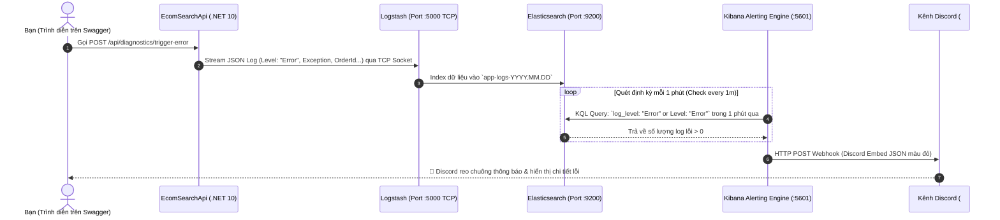

# Kịch Bản Thuyết Trình & Live Demo Alerting Kibana $\rightarrow$ Discord (`demo-alert.md`)

Tài liệu này là kịch bản hướng dẫn từng bước (Step-by-Step Demo Script) để bạn tự tin trình diễn tính năng **Cảnh Báo Tự Động (Alerting)** từ Kibana đẩy về **Discord qua Webhook** trong buổi báo cáo/thuyết trình.

---

## 1. Sơ Đồ Kiến Trúc Luồng Cảnh Báo (Trình chiếu mở đầu)



---

## 2. Chuẩn Bị Trước Giờ Demo (Checklist 2 phút)

1. **Hạ tầng Docker đang chạy**:
   ```powershell
   docker compose up -d
   ```
   *(Đảm bảo cả 3 container `elasticsearch`, `logstash`, `kibana` đều đang Running trên Docker Desktop)*.

2. **Web API .NET đang chạy**:
   ```powershell
   cd EcomSearchApi
   dotnet run
   ```
   Mở Swagger UI trên trình duyệt: [http://localhost:5242](http://localhost:5242) (hoặc port đang chạy).

3. **Mở sẵn 2 cửa sổ trên màn hình**:
   * **Màn hình 1**: Giao diện kênh Discord `#kibana-alerts`.
   * **Màn hình 2**: Kibana Dashboard / Discover [http://localhost:5601](http://localhost:5601) và Swagger UI.

---

## 3. Các Bước Thực Hiện Live Demo (Kịch Bản 4 Bước)

### Bước 1: Giới thiệu hệ thống đang ở trạng thái bình thường (Baseline)
* **Thao tác**: Mở Dashboard Kibana hoặc trang Rules (*Stack Management $\rightarrow$ Rules*).
* **Lời thoại**: *"Hiện tại hệ thống đang chạy ổn định, Rule cảnh báo `[EcomSearchApi] Error Log Alert Detected` đang ở trạng thái OK (màu xanh), chưa có lỗi nào được phát hiện trong 5 phút qua."*

---

### Bước 2: Kích hoạt sự cố lỗi giả lập (Trigger Error)
* **Thao tác**: Mở tab Swagger UI $\rightarrow$ Tìm Controller **`Diagnostics`**.
* **Lựa chọn 1 trong 2 tình huống demo**:

  * **Tình huống A - Lỗi nghiệp vụ thanh toán (Business Error)**:
    1. Mở endpoint `POST /api/diagnostics/trigger-error`.
    2. Nhập `message`: `Payment gateway VNPAY timed out during checkout transaction.`
    3. Nhập `orderId`: `ORD-998877`
    4. Bấm **Execute**.
    5. Swagger trả về mã `HTTP 200` kèm thông báo log Error đã được stream qua Logstash.

  * **Tình huống B - Lỗi sập kết nối Database (Unhandled Exception)**:
    1. Mở endpoint `POST /api/diagnostics/simulate-exception`.
    2. Nhập `serviceName`: `InventorySyncService`
    3. Bấm **Execute** $\rightarrow$ API trả về `HTTP 500 Internal Server Error` kèm Exception stack trace.

---

### Bước 3: Quan sát dữ liệu trên Kibana (Phản ứng tức thì)
* **Thao tác**: Chuyển sang tab **Kibana Discover** hoặc **Dashboard**:
  * Bấm **Refresh**.
  * Cột màu đỏ xuất hiện trên biểu đồ `Log Volume by Severity`.
  * Thẻ số đếm `Total Errors` nhảy lên.
  * Bảng `Recent Error Logs Table` hiển thị ngay bản ghi lỗi vừa phát sinh kèm mã `Trace / Request ID`.

---

### Bước 4: Đón nhận thông báo trên Discord (Kết quả cuối cùng)
* **Thao tác**: Chuyển sang màn hình **Discord**:
* **Kết quả**: Trong vòng chưa đầy 1 phút, con bot `Kibana Alert Bot` sẽ gửi một tin nhắn **Discord Embed** viền đỏ rực rỡ với cấu trúc:
  * **Tiêu đề**: `🚨 [ALERT] Error Log Detected in EcomSearchApi!`
  * **Rule Name**: `[EcomSearchApi] Error Log Alert Detected`
  * **Error Log Count**: `1 errors in the last minute`
  * **Môi trường**: `Development / Docker`
  * **Thời gian**: Tự động chuyển đổi sang ngày/giờ/phút/giây chuẩn Việt Nam (`Hôm nay lúc ...`).

---

## 4. Các Câu Hỏi Trọng Tâm Giúp Bạn Ghi Điểm Khi Thuyết Trình

### ❓ Câu 1: "Tại sao không viết code C# gọi thẳng Webhook Discord khi có Exception mà phải thông qua Kibana?"
* **Trả lời (3 ý cốt lõi)**:
  1. **Chống bão thông báo (Anti-Alert Storm / Rate-limit)**: Nếu Database sập sinh ra 1.000 lỗi/giây, code C# sẽ spam 1.000 request làm Discord khóa webhook. Kibana có bộ đệm tổng hợp (Aggregation) gom 1.000 lỗi đó vào đúng 1 thông báo tóm tắt.
  2. **Tách biệt trách nhiệm (Decoupling)**: Khi cần đổi ngưỡng (5 lỗi/phút), đổi kênh nhận (Discord $\rightarrow$ Slack $\rightarrow$ Telegram), chỉ cần thao tác trên UI Kibana trong 10 giây mà **không cần sửa code, build hay deploy lại API**.
  3. **Dead Man's Switch (Giám sát khi sập nguồn)**: Nếu server bị mất điện hoặc tiến trình .NET bị crash hoàn toàn, code C# chết không thể gửi alert, nhưng Kibana đứng ngoài phát hiện mất log sẽ cảnh báo server down.

---

### ❓ Câu 2: "Khác biệt giữa `Check every` (1m) và `For the last` (1m) là gì?"
* **Trả lời**:
  * `Check every 1m`: Là **tần suất kiểm tra** (Cứ mỗi 1 phút Kibana tự động thức dậy chạy câu query một lần).
  * `For the last 1m`: Là **cửa sổ thời gian quét dữ liệu** (Mỗi lần thức dậy, Kibana quét dữ liệu trong 1 phút vừa qua để đếm số lượng log lỗi).

---

### ❓ Câu 3: "Vì sao nên chọn Action Frequency là `On check intervals` thay vì `On status changes` khi demo?"
* **Trả lời**:
  * `On status changes`: Chỉ gửi tin nhắn khi trạng thái chuyển từ Xanh (OK) $\rightarrow$ Đỏ (Alert). Nếu lỗi vẫn tiếp diễn ở phút sau, nó sẽ không gửi lại để tránh spam.
  * `On check intervals`: Cứ mỗi chu kỳ quét (mỗi 1 phút), nếu vẫn phát hiện có log lỗi là tiếp tục gửi tin nhắn cảnh báo, rất thuận tiện khi cần test và demo liên tục.
