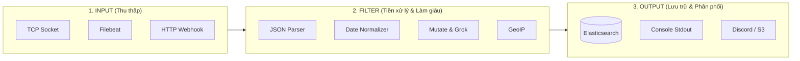

# Cẩm Nang Cấu Hình & Pipeline Logstash Toàn Diện (`demo-logstash.md`)

Tài liệu này tổng hợp toàn bộ kiến thức về kiến trúc **Logstash Processing Pipeline** (`Input` $\rightarrow$ `Filter` $\rightarrow$ `Output`), cấu trúc các plugin quan trọng nhất, kèm cú pháp chuẩn (Syntax) và ví dụ thực tế (Examples).

---

## MỤC LỤC

1. [Tổng Quan Kiến Trúc Logstash Pipeline](#1-tổng-quan-kiến-trúc-logstash-pipeline)
2. [Phần 1: Các Kiểu Input Thường Gặp (Input Plugins)](#phần-1-các-kiểu-input-thường-gặp-input-plugins)
3. [Phần 2: Các Bộ Lọc Dữ Liệu Cốt Lõi (Filter Plugins)](#phần-2-các-bộ-lọc-dữ-liệu-cốt-lõi-filter-plugins)
4. [Phần 3: Các Kiểu Output Phổ Biến (Output Plugins)](#phần-3-các-kiểu-output-phổ-biến-output-plugins)
5. [Phần 4: Phân Tích Chuyên Sâu File `logstash.conf` Của Dự Án](#phần-4-phân-tích-chuyên-sâu-file-logstashconf-của-dự-án)

---

## 1. Tổng Quan Kiến Trúc Logstash Pipeline

Logstash hoạt động như một **đường ống xử lý dữ liệu (Data Processing Pipeline)** gồm 3 giai đoạn độc lập:



---

## Phần 1: Các Kiểu Input Thường Gặp (Input Plugins)

### 1.1. Input `tcp` (Nhận Log qua TCP Socket từ ứng dụng - Dùng trong dự án)
* **Cú pháp (Syntax):**
  ```ruby
  input {
    tcp {
      port => <cổng_lắng_nghe>
      codec => <bộ_giải_mã>
    }
  }
  ```
* **Ví dụ thực tế:**
  ```ruby
  input {
    tcp {
      port => 5000
      codec => json_lines   # Tự động parse từng dòng JSON do Serilog gửi qua socket
    }
  }
  ```

---

### 1.2. Input `beats` (Nhận Log từ Filebeat / Metricbeat)
* **Cú pháp (Syntax):**
  ```ruby
  input {
    beats {
      port => <cổng_lắng_nghe>
    }
  }
  ```
* **Ví dụ thực tế:**
  ```ruby
  input {
    beats {
      port => 5044
    }
  }
  ```

---

### 1.3. Input `http` (Nhận Webhook từ dịch vụ thứ 3)
* **Cú pháp (Syntax):**
  ```ruby
  input {
    http {
      host => "0.0.0.0"
      port => 8080
      user => "admin"
      password => "secret"
    }
  }
  ```
* **Giải thích:** Biến Logstash thành một HTTP Server lắng nghe các request POST Webhook gửi đến port 8080.

---

### 1.4. Input `file` (Đọc trực tiếp file log trên đĩa cứng)
* **Cú pháp (Syntax):**
  ```ruby
  input {
    file {
      path => "<đường_dẫn_file>"
      start_position => "beginning" # hoặc "end"
      sincedb_path => "/dev/null"   # Đọc lại từ đầu mỗi khi restart (phục vụ test)
    }
  }
  ```
* **Ví dụ thực tế:**
  ```ruby
  input {
    file {
      path => "/var/log/nginx/access.log"
      start_position => "beginning"
    }
  }
  ```

---

## Phần 2: Các Bộ Lọc Dữ Liệu Cốt Lõi (Filter Plugins)

Filter là "trái tim" của Logstash, nơi biến dữ liệu thô (raw text) thành dữ liệu có cấu trúc (structured JSON) trước khi nạp vào Elasticsearch.

---

### 2.1. Filter `json` (Bóc tách chuỗi JSON)
* **Cú pháp (Syntax):**
  ```ruby
  filter {
    json {
      source => "<tên_trường_chứa_chuỗi_json>"
      target => "<tên_object_đích_tùy_chọn>"
    }
  }
  ```
* **Ví dụ thực tế:**
  ```ruby
  filter {
    json {
      source => "message"    # Bóc tách trường "message" thành các trường riêng lẻ
      target => "parsed_log"
    }
  }
  ```

---

### 2.2. Filter `date` (Chuẩn hóa thời gian sang `@timestamp`)
* **Cú pháp (Syntax):**
  ```ruby
  filter {
    date {
      match => [ "<tên_trường_thời_gian>", "<định_dạng_1>", "<định_dạng_2>", ... ]
      target => "@timestamp"
      remove_field => [ "<tên_trường_cũ>" ]
    }
  }
  ```
* **Ví dụ thực tế trong dự án:**
  ```ruby
  filter {
    if [Timestamp] {
      date {
        match => [ "Timestamp", "ISO8601", "yyyy-MM-dd HH:mm:ss.SSS" ]
        target => "@timestamp"
        remove_field => [ "Timestamp" ]
      }
    }
  }
  ```
* **Ý nghĩa:** Đảm bảo thời gian của log trên Kibana phản ánh **đúng thời điểm sự kiện xảy ra trong code .NET**, thay vì thời điểm Logstash nhận được gói tin qua mạng.

---

### 2.3. Filter `mutate` (Biến đổi, thêm, xóa, đổi tên trường)
* **Cú pháp (Syntax):**
  ```ruby
  filter {
    mutate {
      add_field    => { "<tên_mới>" => "<giá_trị>" }
      rename       => { "<tên_cũ>" => "<tên_mới>" }
      convert      => { "<tên_trường>" => "integer/float/string/boolean" }
      remove_field => [ "<trường_cần_xóa_1>", "<trường_cần_xóa_2>" ]
      gsub         => [ "<tên_trường>", "<ký_tự_cần_thay>", "<ký_tự_mới>" ]
    }
  }
  ```
* **Ví dụ thực tế:**
  ```ruby
  filter {
    mutate {
      add_field => { "environment" => "production" }
      rename    => { "Level" => "log_level" }
      convert   => { "StatusCode" => "integer" }
      remove_field => [ "headers", "host", "@version" ]
    }
  }
  ```

---

### 2.4. Filter `grok` (Phân tích log văn bản phi cấu trúc bằng Regular Expressions)
* **Cú pháp (Syntax):**
  ```ruby
  filter {
    grok {
      match => { "<tên_trường>" => "%{PATTERN_NAME:FIELD_NAME}" }
    }
  }
  ```
* **Ví dụ thực tế (Bóc tách Access Log HTTP của Nginx hoặc ASP.NET):**
  * *Chuỗi log gốc:* `"HTTP POST /api/search responded 200 in 15.42 ms"`
  ```ruby
  filter {
    grok {
      match => { 
        "message" => "HTTP %{WORD:http_method} %{URIPATH:request_path} responded %{NUMBER:status_code:int} in %{NUMBER:elapsed_ms:float} ms" 
      }
    }
  }
  ```
* *Kết quả sinh ra 4 trường riêng biệt:*
  * `http_method`: `"POST"`
  * `request_path`: `"/api/search"`
  * `status_code`: `200`
  * `elapsed_ms`: `15.42`

---

### 2.5. Filter `drop` (Lọc bỏ các log rác không quan trọng)
* **Cú pháp (Syntax):**
  ```ruby
  filter {
    if <điều_kiện> {
      drop { }
    }
  }
  ```
* **Ví dụ thực tế (Bỏ qua các request kiểm tra sức khỏe `healthcheck` để tránh rác index):**
  ```ruby
  filter {
    if [RequestPath] =~ /^\/health/ or [RequestPath] =~ /^\/swagger/ {
      drop { }
    }
  }
  ```

---

### 2.6. Filter `geoip` (Tra cứu vị trí địa lý từ địa chỉ IP của Client)
* **Cú pháp (Syntax):**
  ```ruby
  filter {
    geoip {
      source => "<tên_trường_chứa_ip>"
      target => "geoip"
    }
  }
  ```
* **Ví dụ thực tế:**
  ```ruby
  filter {
    geoip {
      source => "client_ip"
    }
  }
  ```
* *Kết quả tự động sinh ra:* `geoip.country_name` (Việt Nam), `geoip.city_name` (Hà Nội), `geoip.location` (kinh độ, vĩ độ để vẽ bản đồ Kibana Map).

---

## Phần 3: Các Kiểu Output Phổ Biến (Output Plugins)

### 3.1. Output `elasticsearch` (Đẩy log vào Index theo ngày - Dùng trong dự án)
* **Cú pháp (Syntax):**
  ```ruby
  output {
    elasticsearch {
      hosts => [ "http://<ip>:<port>" ]
      index => "<tên_index_động_theo_ngày>"
      user  => "<username>"
      password => "<password>"
    }
  }
  ```
* **Ví dụ thực tế:**
  ```ruby
  output {
    elasticsearch {
      hosts => ["http://elasticsearch:9200"]
      index => "app-logs-%{+YYYY.MM.dd}"   # Tự động tạo index mới mỗi ngày
    }
  }
  ```

---

### 3.2. Output `stdout` (In ra Console để Debug khi dựng hệ thống)
* **Cú pháp (Syntax):**
  ```ruby
  output {
    stdout {
      codec => rubydebug
    }
  }
  ```
* **Ý nghĩa:** Khi chạy `docker logs logstash -f`, bạn sẽ thấy toàn bộ log được in ra terminal dưới dạng JSON màu mè rõ ràng để kiểm tra xem Filter bóc tách đúng hay chưa.

---

### 3.3. Output `http` (Bắn Webhook trực tiếp sang Discord / Slack không cần Kibana)
* **Cú pháp (Syntax):**
  ```ruby
  output {
    if [Level] == "Error" {
      http {
        url => "https://discord.com/api/webhooks/..."
        http_method => "post"
        format => "json"
        headers => { "Content-Type" => "application/json" }
        mapping => {
          "content" => "🚨 Logstash phát hiện lỗi: %{message}"
        }
      }
    }
  }
  ```

---

## Phần 4: Phân Tích Chuyên Sâu File `logstash.conf` Của Dự Án

Dưới đây là toàn bộ cấu hình file thực tế đang chạy trong dự án `EcomSearchApi`:

```ruby
# 1. INPUT: Nhận dữ liệu stream JSON từ Serilog qua cổng TCP 5000
input {
  tcp {
    port => 5000
    codec => json_lines
  }
}

# 2. FILTER: Chuẩn hóa dữ liệu
filter {
  # Bóc tách Timestamp từ Serilog và chuyển thành @timestamp chính thống của Elastic
  if [Timestamp] {
    date {
      match => [ "Timestamp", "ISO8601", "yyyy-MM-dd HH:mm:ss.SSS" ]
      target => "@timestamp"
      remove_field => [ "Timestamp" ]
    }
  }

  # Tạo trường phụ log_level đồng nhất cho Kibana dễ truy vấn
  if [Level] {
    mutate {
      add_field => { "log_level" => "%{Level}" }
    }
  }
}

# 3. OUTPUT: Đẩy vào Elasticsearch và in ra console để debug
output {
  elasticsearch {
    hosts => ["http://elasticsearch:9200"]
    index => "app-logs-%{+YYYY.MM.dd}"
  }

  # In ra Docker stdout để xem trực tiếp bằng lệnh `docker logs logstash -f`
  stdout {
    codec => rubydebug
  }
}
```
